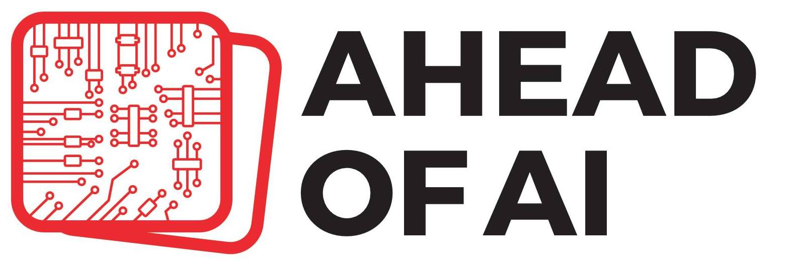

### Hi there, I am Sebastian 👋

and I am a machine learning and AI researcher with a strong passion for education!

- ⚡️ As Lead AI Educator at [Lightning AI](https://lightning.ai), I am excited about making AI & deep learning more accessible and teaching people how to utilize AI & deep learning at scale. Check out my latest course [Deep Learning Fundamentals – Learning Deep Learning With a Modern Open Source Stack](https://lightning.ai/pages/courses/deep-learning-fundamentals/).
- 🎓 Previously, I was an Assistant Professor of Statistics at the [University of Wisconsin-Madison](https://www.wisc.edu) (tenure track 2018-2025) until 2022, focusing on deep learning and machine learning research. Have a look at my [research projects](https://sebastianraschka.com/publications/) if you'd like to find out more.
- 🎮 But most of all, I am a passionate coder who loves open-source software! 
- 📖 I also love writing! For example, I wrote the *[Machine Learning with PyTorch and Scikit-Learn](https://www.amazon.com/Machine-Learning-PyTorch-Scikit-Learn-scikit-learn-ebook-dp-B09NW48MR1/dp/B09NW48MR1/)* book and write the [Ahead of AI newsletter](https://magazine.sebastianraschka.com) where I am covering the latest deep learning and AI research.

---

If you are interested in more details, check out [my website](https://sebastianraschka.com)!  

#### Socials

I am also more active on social platforms than I should be!

- 🧵 [@sebastianraschka](https://www.threads.net/@sebastianraschka) on Threads
- 👨‍💻 Twitter [(@rasbt)](https://twitter.com/rasbt)
- 🖇️ LinkedIn [in/sebastianraschka](https://www.linkedin.com/in/sebastianraschka/)

