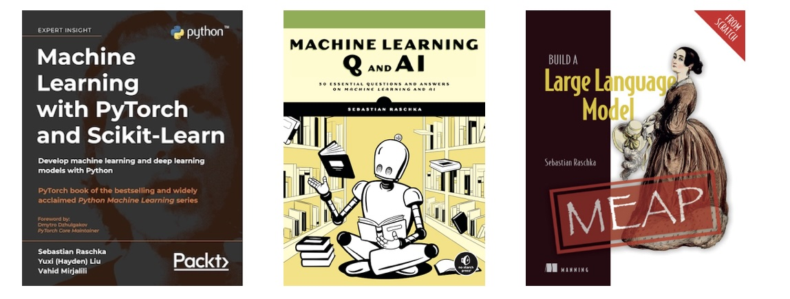

### Hi there, I am Sebastian 👋

and I am a machine learning and AI researcher with a strong passion for education!

- ⚡️ As Staff Research Engineer at [Lightning AI](https://lightning.ai), I am working on the intersection of AI research, software development, and large language models (LLMs).
- 🎓 Previously, I was an Assistant Professor of Statistics at the [University of Wisconsin-Madison](https://www.wisc.edu) (tenure track 2018-2025) until 2022, focusing on deep learning and machine learning research.
- 🎮 But most of all, I am a passionate coder who loves open-source software! 
- 📖 I also love writing and authored several books!

(Links and more info [here](https://sebastianraschka.com/books).)

---

If you are interested in more details, check out [my website](https://sebastianraschka.com) !  

#### Socials

I am also more active on social platforms than I should be!

- 📝 Substack Blog [Ahead of AI](https://magazine.sebastianraschka.com)
- 👨‍💻 Twitter [(@rasbt)](https://twitter.com/rasbt)
- 🖇️ LinkedIn [in/sebastianraschka](https://www.linkedin.com/in/sebastianraschka/)

